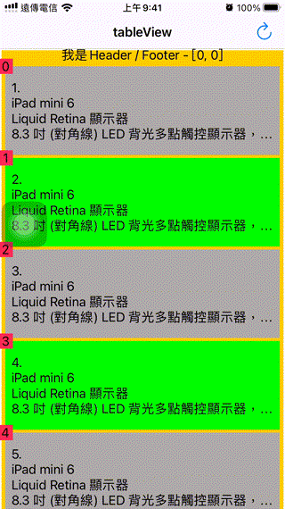

# WWCompositionalLayout
[](https://developer.apple.com/swift/) [](https://developer.apple.com/swift/) [](https://developer.apple.com/swift/) [](https://developer.apple.com/swift/)

A simple integrated version of iOS 13 [Compositional Layout](https://developer.apple.com/documentation/uikit/views_and_controls/collection_views/layouts), modified into a way similar to [Functional Programming](https://ithelp.ithome.com.tw/articles/10233399) to generate UICollectionViewCompositionalLayout.

iOS 13 [Compositional Layout](https://www.appcoda.com.tw/compositional-layout/)的簡單整合版，修改成類似[Functional Programming](https://ithelp.ithome.com.tw/articles/10233399)的方式來生成UICollectionViewCompositionalLayout。



### [Installation with Swift Package Manager](https://medium.com/彼得潘的-swift-ios-app-開發問題解答集/使用-spm-安裝第三方套件-xcode-11-新功能-2c4ffcf85b4b)
```
dependencies: [
    .package(url: "https://github.com/William-Weng/WWCompositionalLayout.git", .upToNextMajor(from: "1.0.0"))
]
```

### Example
```swift
import UIKit
import WWPrint
import WWCompositionalLayout

final class ViewController: UIViewController {
    
    @IBOutlet weak var myCollectionView: UICollectionView!
    
    private let badgeViewKey = "Badge"
    private let contentInsets = NSDirectionalEdgeInsets(top: 5, leading: 5, bottom: 5, trailing: 5)
    private let edgeInsets = NSDirectionalEdgeInsets(top: 2, leading: 2, bottom: 2, trailing: 2)
    private let backgroundInsets = NSDirectionalEdgeInsets(top: 2, leading: 2, bottom: 2, trailing: 2)
    private let firstBadgeSetting: WWCompositionalLayout.BadgeSetting = (key: "Badge", size: (width: .absolute(20), height: .absolute(20)), zIndex: 100,
containerAnchor: (edges: [.top, .leading], absoluteOffset: CGPoint(x: 10, y: 10)), itemAnchor: (edges: [.bottom, .trailing], absoluteOffset: CGPoint(x: 0, y: 0)))
    
    private var currentLayoutIndex = 0
    
    enum LayoutType: Int, CaseIterable {
        case tableView
        case photoAlbum
        case bookshelf
        case vendingMachine
        case dynamicHeight
        case complexGroup
    }
    
    override func viewDidLoad() {
        super.viewDidLoad()
        initSetting()
    }
    
    /// 更新Layout
    /// - Parameter sender: UIBarButtonItem
    @IBAction func changeLayout(_ sender: UIBarButtonItem) {
        currentLayoutIndex += 1
        if (currentLayoutIndex > (LayoutType.allCases.count - 1)) { currentLayoutIndex = 0 }
        initSetting()
    }
}

// MARK: UICollectionViewDataSource
extension ViewController: UICollectionViewDataSource {

    func numberOfSections(in collectionView: UICollectionView) -> Int { return 10 }
    
    func collectionView(_ collectionView: UICollectionView, numberOfItemsInSection section: Int) -> Int { return MyCollectionViewCell.dataSource.count }
    
    func collectionView(_ collectionView: UICollectionView, cellForItemAt indexPath: IndexPath) -> UICollectionViewCell {
        
        let cell = collectionView._reusableCell(at: indexPath) as MyCollectionViewCell
        cell.configure(with: indexPath)
        
        return cell
    }
    
    func collectionView(_ collectionView: UICollectionView, viewForSupplementaryElementOfKind kind: String, at indexPath: IndexPath) -> UICollectionReusableView {
                
        if kind == "\(WWCompositionalLayout.ReusableSupplementaryViewKind.header)" {
            let header = collectionView._reusableSupplementaryView(at: indexPath, ofKind: .header) as MyCollectionReusableHeader
            header.configure(with: indexPath)
            return header
        }
        
        if kind == "\(WWCompositionalLayout.ReusableSupplementaryViewKind.footer)" {
            let header = collectionView._reusableSupplementaryView(at: indexPath, ofKind: .footer) as MyCollectionReusableHeader
            header.configure(with: indexPath)
            return header
        }
        
        let badge = collectionView._reusableSupplementaryView(at: indexPath, ofKind: .badge(key: badgeViewKey)) as MyCollectionReusableBadge
        badge.configure(with: indexPath)
        
        return badge
    }
}

// MARK: UICollectionViewDataSource
extension ViewController: UICollectionViewDelegate, UINavigationControllerDelegate {}

// MARK: 小工具
extension ViewController {
    
    /// 初始化設定
    private func initSetting() {
        
        guard let layoutType = LayoutType.allCases[safe: currentLayoutIndex],
              let layout = layoutMaker(with: layoutType)
        else {
            return
        }

        title = "\(layoutType)"
        myCollectionView._delegateAndDataSource(with: self)
        myCollectionView.setCollectionViewLayout(layout, animated: true)
    }
    
    /// Layout選擇器
    /// - Parameter type: LayoutType
    /// - Returns: UICollectionViewCompositionalLayout?
    private func layoutMaker(with type: LayoutType) -> UICollectionViewCompositionalLayout? {
        
        switch type {
        case .tableView: return tableViewLayout()
        case .photoAlbum: return photoAlbumLayout()
        case .bookshelf: return bookshelfLayout()
        case .vendingMachine: return vendingMachineLayout()
        case .dynamicHeight: return dynamicHeightLayout()
        case .complexGroup: return complexGroupLayout()
        }
    }
}

// MARK: - CompositionalLayout
extension ViewController {
    
    /// 長得像UITableView的Layout
    /// - Returns: UICollectionViewCompositionalLayout?
    private func tableViewLayout() -> UICollectionViewCompositionalLayout? {
        
        let layout = WWCompositionalLayout.shared
            .addItem(width: .fractionalWidth(1.0), height: .absolute(120), contentInsets: edgeInsets, badgeSetting: firstBadgeSetting)
            .setDecoration(with: backgroundInsets)
            .setGroup(width: .fractionalWidth(1.0), height: .absolute(120), scrollingDirection: .horizontal)
            .setSection(with: .none, contentInsets: contentInsets)
            .setHeader(width: .fractionalWidth(1.0), height: .absolute(16))
            .setFooter(width: .fractionalWidth(0.5), height: .absolute(16))
            .build()
        
        return layoutRegister(layout)
    }
    
    /// 長得像相簿的Layout
    /// - Returns: UICollectionViewCompositionalLayout?
    private func photoAlbumLayout() -> UICollectionViewCompositionalLayout? {
        
        let layout = WWCompositionalLayout.shared
            .addItem(width: .fractionalWidth(1/3), height: .absolute(120), contentInsets: edgeInsets)
            .setDecoration(with: backgroundInsets)
            .setGroup(width: .fractionalWidth(1.0), height: .absolute(120), scrollingDirection: .horizontal)
            .setSection(with: .none, contentInsets: contentInsets)
            .setHeader(width: .fractionalWidth(1.0), height: .absolute(16))
            .setFooter(width: .fractionalWidth(0.5), height: .absolute(16))
            .build()
        
        return layoutRegister(layout)
    }
    
    /// 長得像書櫃的Layout
    /// - Parameter count: 一頁要顯示幾本
    /// - Returns: UICollectionViewCompositionalLayout?
    private func bookshelfLayout(with count: CGFloat = 4.0) -> UICollectionViewCompositionalLayout? {
        
        let mainScreenWidth = UIScreen.main.bounds.width
        let contentInsets = NSDirectionalEdgeInsets(top: 5, leading: mainScreenWidth/2 - mainScreenWidth/2/count, bottom: 5, trailing: mainScreenWidth/2/count)
        
        let layout = WWCompositionalLayout.shared
            .addItem(width: .fractionalWidth(1.0), height: .absolute(120), contentInsets: edgeInsets, badgeSetting: nil)
            .setDecoration(with: backgroundInsets)
            .setGroup(width: .fractionalWidth(1/count), height: .absolute(120), scrollingDirection: .vertical)
            .setSection(with: .continuousGroupLeadingBoundary, contentInsets: contentInsets)
            .setHeader(width: .fractionalWidth(1.0), height: .absolute(16))
            .setFooter(width: .fractionalWidth(0.5), height: .absolute(16))
            .build()
        
        return layoutRegister(layout)
    }
    
    /// 長得像自動販賣機的Layout
    /// - Returns: UICollectionViewCompositionalLayout?
    private func vendingMachineLayout() -> UICollectionViewCompositionalLayout? {
        
        let layout = WWCompositionalLayout.shared
            .addItem(width: .fractionalWidth(1.0), height: .absolute(50), contentInsets: edgeInsets, badgeSetting: nil)
            .addItem(width: .fractionalWidth(1.0), height: .absolute(100), contentInsets: edgeInsets, badgeSetting: nil)
            .addItem(width: .fractionalWidth(1.0), height: .absolute(150), contentInsets: edgeInsets, badgeSetting: nil)
            .setDecoration(with: backgroundInsets)
            .setGroup(width: .fractionalWidth(1/2), height: .estimated(100), scrollingDirection: .vertical)
            .setSection(with: .continuousGroupLeadingBoundary, contentInsets: contentInsets)
            .setHeader(width: .fractionalWidth(1.0), height: .absolute(16))
            .setFooter(width: .fractionalWidth(0.5), height: .absolute(16))
            .build()
        
        return layoutRegister(layout)
    }
    
    /// 動態高度的Layout
    /// - Returns: UICollectionViewCompositionalLayout?
    private func dynamicHeightLayout() -> UICollectionViewCompositionalLayout? {
        
        let layout = WWCompositionalLayout.shared
            .addItem(width: .fractionalWidth(1.0), height: .estimated(120), contentInsets: edgeInsets, badgeSetting: firstBadgeSetting)
            .setGroup(width: .fractionalWidth(1.0), height: .estimated(120), scrollingDirection: .horizontal)
            .setDecoration(with: backgroundInsets)
            .setSection(with: .none, contentInsets: contentInsets)
            .setHeader(width: .fractionalWidth(1.0), height: .absolute(16))
            .setFooter(width: .fractionalWidth(0.5), height: .absolute(16))
            .build()
        
        return layoutRegister(layout)
    }
    
    /// 混合式的Layout
    /// - Returns: UICollectionViewCompositionalLayout?
    private func complexGroupLayout() -> UICollectionViewCompositionalLayout? {
        
        let groupSetting = WWCompositionalLayout.GroupSetting(width: .estimated(100), height: .absolute(200), interItemSpacing: .fixed(2), scrollingDirection: .vertical)
        let sectionSetting = WWCompositionalLayout.SectionSetting(scrollingBehavior: .continuous, contentInsets: .zero)
        
        let groupLayout1 = WWCompositionalLayout.shared
            .addItem(width: .absolute(120), height: .absolute(120), contentInsets: edgeInsets, badgeSetting: firstBadgeSetting)
            .setGroup(width: .absolute(120), height: .absolute(120), scrollingDirection: .horizontal)
            .groupLayoutMaker()
        
        let groupLayout2 = WWCompositionalLayout.shared
            .addItem(width: .absolute(60), height: .absolute(60), contentInsets: edgeInsets, badgeSetting: nil)
            .setGroup(width: .absolute(120), height: .absolute(60), scrollingDirection: .horizontal)
            .groupLayoutMaker()
        
        guard let groupLayout1 = groupLayout1,
              let groupLayout2 = groupLayout2
        else {
            return nil
        }
        
        let layout = WWCompositionalLayout.shared
            .addGroup(with: groupLayout1)
            .addGroup(with: groupLayout2)
            .setDecoration(with: backgroundInsets)
            .setSection(with: .none, contentInsets: contentInsets)
            .setHeader(width: .fractionalWidth(1.0), height: .absolute(16))
            .setFooter(width: .fractionalWidth(1.0), height: .absolute(16))
            .build(with: groupSetting, sectionSetting: sectionSetting)
        
        return layoutRegister(layout)
    }
}

// MARK: - CompositionalLayout
extension ViewController {
    
    /// 註冊CollectionReusableView
    /// - Parameter layout:
    /// - Returns: UICollectionViewLayout?
    private func layoutRegister(_ layout: UICollectionViewCompositionalLayout?) -> UICollectionViewCompositionalLayout? {
        
        guard let layout = layout else { return nil }
        
        let newLayout = layout
            ._register(with: myCollectionView, supplementaryViewClass: MyCollectionReusableHeader.self, ofKind: .header)
            ._register(with: myCollectionView, supplementaryViewClass: MyCollectionReusableHeader.self, ofKind: .footer)
            ._register(with: myCollectionView, supplementaryViewClass: MyCollectionReusableBadge.self, ofKind: .badge(key: badgeViewKey))
            ._register(with: MyCollectionReusableDecoration.self, ofKind: .decoration)
            ._register(with: MyCollectionReusableBadge.self, ofKind: .badge(key: badgeViewKey))
        
        return newLayout
    }
}
```